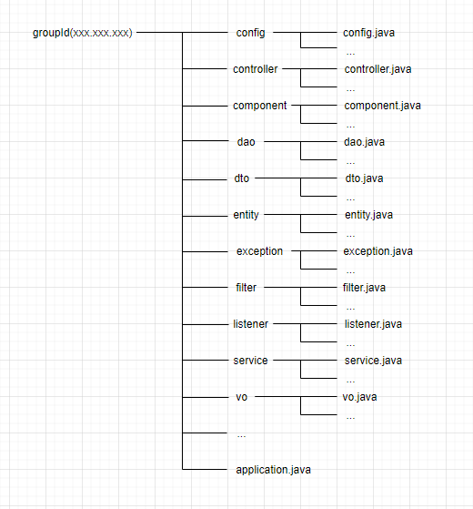

# Java 后端目录结构

> Maven Spring / SpringBoot 项目

Java 代码存放在 **groupId** 迭代目录下

1. Spring 项目启动类: `<artifactId>Application.java`
2. Config 目录: 配置类
3. Component 目录: 代码减重对象的 Bean (多个类中使用的相同对象)
4. Exception 目录: 自定义异常
5. Filter 目录: 过滤器
6. Interceptor 目录: 拦截器
7. Listener 目录: 监听器
8. Entity 目录: 实体类(应使用 @Component 注解)
9. DTO 目录: 数据传输对象(Controller 的传入参数)
10. VO 目录: 值对象(Controller 的返回值: 表现层对象)
11. QO 目录: 查询对象
12. DAO 目录: 数据库操作对象
13. Mapper 目录: 使用 MyBatis 框架下的数据库操作映射接口
14. Repository 目录: 使用 JPA 框架下的数据库操作接口
15. Service 目录: 服务内部逻辑
16. Controller 目录: 映射控制器
17. Utils 目录: 自定义工具类(对某个组件的方便使用)
18. ...

> VO: value object / view object 值/显示层
>
> > 抽象出的业务对象
>
> PO: persistant object 持久化 (只用 get & set 的数据库操作)
>
> > 一个 PO 对象对应一个数据库中的一条记录
> >
> > 多条记录则使用 PO 集合
>
> DAO: data access object 数据访问 
>
> DTO: data transfer object 数据传输
>
> QO: query object 查询
>
> BO: business object 业务
>
> O / R Mapper : object relationship mapper 对象 关系 映射

